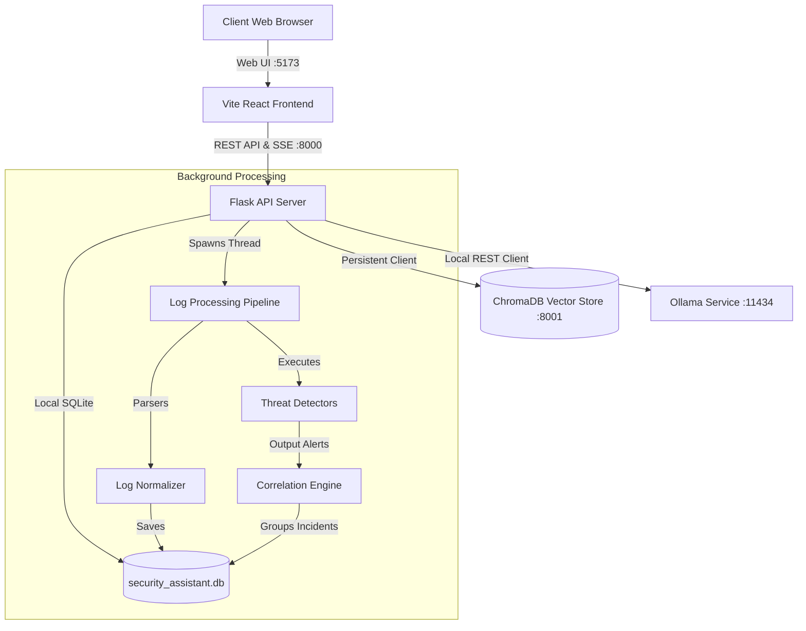
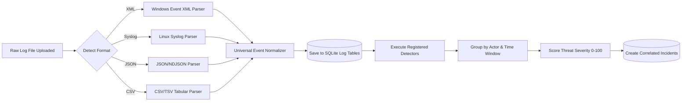
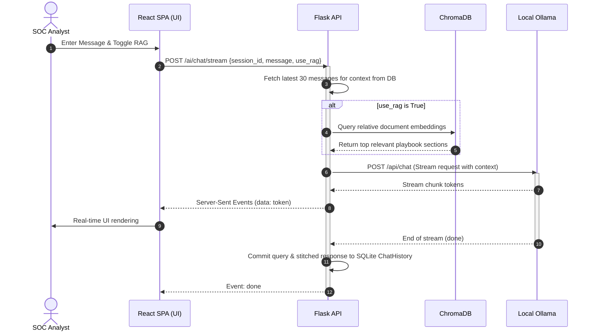
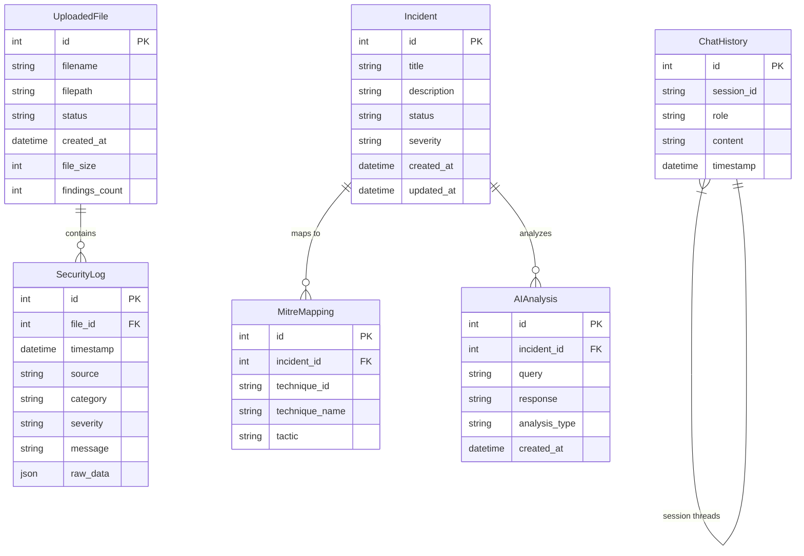

# 🛡️ Security Log Analysis Assistant

[](https://opensource.org/licenses/MIT)
[](https://www.python.org/downloads/)
[](https://react.dev/)
[](https://tailwindcss.com/)
[](https://www.trychroma.com/)
[](https://ollama.com/)

An enterprise-grade, **local-first, completely offline Security Operations Center (SOC) tooling** platform. This assistant empowers blue teams and security analysts to ingest raw security logs, perform automatic normalization, execute real-time multi-stage threat detection, group alerts into correlated incidents, map threat tactics to the **MITRE ATT&CK® framework**, and conduct interactive, grounded investigations using a local AI Copilot backed by Ollama and ChromaDB RAG.

Designed specifically for restricted air-gapped networks, critical infrastructure security environments, and privacy-first internal blue teams, the platform mandates **no cloud dependencies, no external telemetry, and no multi-tenant database exposures**.

---

## 📖 Table of Contents
1. [🌟 Real-World Problem & Main Purpose](#-real-world-problem--main-purpose)
2. [✨ Key Features](#-key-features)
3. [📦 Technology Stack](#-technology-stack)
4. [📐 Architecture & Data Pipelines](#-architecture--data-pipelines)
5. [📁 Folder Structure](#-folder-structure)
6. [🔧 Installation Guides](#-installation-guides)
7. [⚙️ System Configuration](#%EF%B8%8F-system-configuration)
8. [📊 Database & ER Schema](#-database--er-schema)
9. [🤖 AI Copilot & RAG Workflow](#-ai-copilot--rag-workflow)
10. [🌐 API Documentation](#-api-documentation)
11. [🔒 Security Posture & Safeguards](#-security-posture--safeguards)
12. [⚡ Performance & Resource Optimization](#-performance--resource-optimization)
13. [🚀 Usage & Testing Sandbox Walkthrough](#-usage--testing-sandbox-walkthrough)
14. [🖼️ UI Screenshots](#%EF%B8%8F-ui-screenshots)
15. [🛠️ Troubleshooting & FAQ](#%EF%B8%8F-troubleshooting--faq)
16. [🗺️ Future Roadmap](#%EF%B8%8F-future-roadmap)
17. [🤝 Contributing & License](#-contributing--license)

---

## 🌟 Real-World Problem & Main Purpose

### The Problem
Modern Security Operations Centers (SOCs) are flooded with raw, high-volume security logs from diverse vendors (Windows Event logs, Linux Syslog, Suricata JSON alerts, CSV network flows). Threat detection often requires piping these logs into costly cloud-based SIEMs or sharing sensitive indicators of compromise (IoCs) and proprietary playbooks with third-party generative AI models (such as OpenAI or Anthropic). In air-gapped networks, military domains, financial institutions, and critical infrastructure, sending telemetry out of the network boundary is a major security violation.

### The Solution
The **Security Log Analysis Assistant** is a **local-first, completely offline** tool designed for internal Blue Team and SOC environments. It runs on local bare metal or dockerized infrastructure, normalizes diverse logs into a unified format, runs automated correlation algorithms to map multi-stage attacks to the MITRE ATT&CK matrix, and grounds local LLM inference (using Ollama) using local Vector Retrieval (ChromaDB) on SOC playbooks, guides, and policies. It contains **no cloud services, no authentication system, no cookies/JWTs, and no multi-tenancy**, prioritizing direct analyst accessibility and 100% data sovereignty.

---

## ✨ Key Features

| Feature | Description | Status | Technology Used |
| :--- | :--- | :--- | :--- |
| **Log Audit Ingestion** | Background-processed ingestion supporting Windows XML/Flat logs, JSON/NDJSON arrays, RFC 5424/BSD Syslog, and CSV/TSV formats. | 🟢 Implemented | Flask background pipeline, `xml.etree` parser, Custom Heuristic Dispatcher |
| **Universal Event Normalization** | Field normalization of disparate properties (e.g. `computer`, `host` $\rightarrow$ `hostname`) into a unified schemas database. | 🟢 Implemented | `normalizer.py`, Pydantic models |
| **Advanced Threat Detectors** | Batch-processing detectors identifying brute-force logins, port scans, privilege escalations, lateral movements, and anomaly rate spikes. | 🟢 Implemented | `DetectionOrchestrator`, sliding-window rate tracking |
| **Correlation & Scoring Engine** | Groups individual alerts into unified multi-stage security incidents, calculating real-time 0–100 threat scores. | 🟢 Implemented | `CorrelationEngine`, `ThreatScoringEngine` |
| **MITRE ATT&CK Mapping** | Automatically maps identified alert types to corresponding MITRE ATT&CK techniques & tactics with matrix visualizations. | 🟢 Implemented | `MITREMapper`, React D3 / Heatmap Component |
| **AI Operations Copilot** | Multi-turn air-gapped chat assistant helping SOC analysts write mitigation scripts and query indexed logs. | 🟢 Implemented | `ChatService`, Ollama REST Client, SSE Streaming |
| **RAG Grounding System** | Ingestion and cosine similarity search over local playbooks, Windows encyclopedias, and Markdown references. | 🟢 Implemented | `RAGQueryService`, ChromaDB, `nomic-embed-text` |
| **Automated Incident Reports** | High-fidelity, print-ready HTML incident reports complete with summary statistics, evidence tables, and MITRE maps. | 🟢 Implemented | `ReportGenerator`, Jinja2 templates (Strict Autoescape) |

---

## 📦 Technology Stack

### Backend
- **Framework:** Flask (Python 3.10+) - lightweight, fast, offline routing.
- **ORM & Database:** SQLAlchemy with local SQLite (`security_assistant.db`) - robust relational storage.
- **Data Validation:** Pydantic V2 - ensures strong typing and strict validation of parsed log models.
- **Templating:** Jinja2 - generates HTML incident reports with strict autoescaping to secure against stored XSS.

### Frontend
- **Framework:** React with Vite & TypeScript - high performance SPA scaffolding.
- **Styling:** Tailwind CSS - responsive utility-first CSS layout.
- **State Management:** Custom React hooks paired with local component state.
- **Interactions:** SSE (Server-Sent Events) - real-time token-by-token streaming from local LLM.

### AI & Vector Store
- **Inference Engine:** Local Ollama service (`http://127.0.0.1:11434`).
- **Models:** `qwen2.5:3b-instruct` / `qwen3.5:9b` (Inference) and `nomic-embed-text` (Embeddings).
- **Vector Database:** ChromaDB - persistent local vector store for RAG indexing.

---

## 📐 Architecture & Data Pipelines

### System Architecture
The application runs entirely within the host machine or a single local Docker Compose stack.



### Log Processing Pipeline


### Sequence Diagram: AI Copilot Request Flow


---

## 📁 Folder Structure

```text
security_log_assistant/
├── backend/                       # Flask application source
│   ├── app/
│   │   ├── ai/                    # Ollama client and multi-turn chat orchestration
│   │   ├── api/                   # REST API routers (logs, incidents, health, reports)
│   │   ├── background/            # Background pipeline processing uploaded files
│   │   ├── core/                  # Settings, constant variables, logging configs
│   │   ├── correlation/           # Threat scoring, clustering engine, MITRE maps
│   │   ├── database/              # SQLite session pool initializer
│   │   ├── detection/             # Rule-based and sliding-window event detectors
│   │   ├── models/                # SQLAlchemy relational database tables
│   │   ├── parsers/               # Log parsers & universal normalizer
│   │   ├── rag/                   # ChromaDB vector wrapper and seed knowledge
│   │   ├── reports/               # HTML layout compiler (Autoescaping Jinja2)
│   │   ├── schemas/               # Pydantic validation structures
│   │   └── main.py                # Main application entry point
│   ├── tests/                     # Unit and integration pytest modules
│   ├── requirements.txt           # Python backend dependencies
│   └── security_assistant.db      # SQLite local database instance
├── frontend/                      # React SPA source
│   ├── src/
│   │   ├── components/            # UI components (log tables, charts, badges, file drops)
│   │   ├── hooks/                 # Custom React API state and stream decoders
│   │   ├── layouts/               # Sidebar and general view wrappers
│   │   ├── pages/                 # Full screen views (Dashboard, Incidents, Copilot, Settings)
│   │   ├── services/              # Axios REST API client bindings
│   │   ├── types/                 # TypeScript type interface configurations
│   │   └── main.tsx               # Client entry point
│   ├── package.json               # Node dependencies and scripts
│   ├── tailwind.config.js         # Tailwind layouts config
│   └── vite.config.ts             # Vite server config
├── Knowledge_base/                # Raw playbooks and MITRE schemas for RAG seeding
├── docker/                        # Specialized component Dockerfiles
└── docker-compose.yml             # Orchestrated multi-container config
```

---

## 🔧 Installation Guides

### Local Machine (Bare Metal)

#### Prerequisites
- **Python:** 3.10 or 3.11 recommended.
- **Node.js:** 18 or newer with npm.
- **Ollama:** Installed locally ([Ollama Homepage](https://ollama.com)).

#### 1. Configure the LLM Engine
Start the local Ollama service and pull the inference and embedding models:
```bash
ollama serve
ollama pull qwen2.5:3b-instruct
ollama pull nomic-embed-text
```

#### 2. Backend Setup
Create a virtual environment, activate it, and install required dependencies:
```bash
# Clone the repository
git clone https://github.com/your-org/security_log_assistant.git
cd security_log_assistant/backend

# Create virtual environment
python3 -m venv .venv
source .venv/bin/activate  # On Windows: .venv\Scripts\activate

# Install requirements
pip install -r requirements.txt

# Run database schema setup and launch API server
python3 -m app.main
```
The Flask backend will start on `http://127.0.0.1:8000`.

#### 3. Frontend Setup
Navigate to the frontend directory, install dependencies, and run the Vite dev server:
```bash
cd ../frontend
npm install
npm run dev
```
Open your browser and navigate to `http://localhost:5173`.

---

### Docker Deployment (Docker Compose)

The entire offline ecosystem can be fully orchestrated using Docker Compose.

```bash
# From the project root directory
docker-compose up --build
```

#### Container Ports Exposed:
- `http://localhost:5173` — React Vite Frontend
- `http://localhost:8000` — Flask API
- `http://localhost:8001` — ChromaDB Vector Store
- `http://localhost:11434` — Local Ollama instance (air-gapped binding)

---

## ⚙️ System Configuration

The backend is configured via Pydantic settings defined in `backend/app/core/settings.py`. These parameters can be customized using environment variables or a `.env` file in the `backend/` directory.

| Environment Variable | Default Value | Purpose |
| :--- | :--- | :--- |
| `SQLITE_URL` | `sqlite:///./security_assistant.db` | Path to the SQLite local database. |
| `CHROMA_DB_PATH` | `./chroma_db` | Storage path for vector indexes. |
| `OLLAMA_BASE_URL` | `http://127.0.0.1:11434` | Endpoint of the Ollama server. |
| `OLLAMA_MODEL` | *Auto-selected* | Pin a specific model or leave empty for auto-selection. |
| `OLLAMA_MAX_CONTEXT` | `16384` | Max context size (reduce for constrained RAM). |
| `OLLAMA_MIN_CONTEXT` | `4096` | Min context window allocated to prompts. |
| `OLLAMA_AUTO_SELECT_MODEL`| `true` | Score and auto-select the best model from the local list. |
| `UPLOAD_DIR` | `./uploads` | Storage path for raw uploaded logs. |
| `REPORT_DIR` | `./reports` | Storage directory for generated HTML reports. |

---

## 📊 Database & ER Schema

SQLite serves as the relational database. Schema models are implemented in `backend/app/models/base.py` via SQLAlchemy.

### Entity-Relationship (ER) Diagram



---

## 🤖 AI Copilot & RAG Workflow

The AI operations system is optimized for high reliability on consumer hardware and extreme air-gapped performance.

### 1. Robust Model Resolution & Capability Scoring
If `OLLAMA_AUTO_SELECT_MODEL` is enabled, the client polls Ollama `/api/show` to query the real context window and parameter size of all downloaded models, ranking them:
$$\text{Score} = \left(\frac{\text{Context Tokens}}{1000}\right) + \left(\text{Parameters in Billions} \times 4\right)$$
This ensures that models with the largest context windows and best logical capacity are chosen first, preventing OOM crashes on smaller hosts.

### 2. Auto-Continuation Response Stitching
Local models often suffer from strict context and output limits (cutoffs mid-sentence or mid-code-block). The custom client in `backend/app/ai/ollama_client.py` solves this by checking Ollama’s `done_reason`. If it equals `"length"` (indicates truncation):
1. The client intercepts the response and generates an automated continuation prompt.
2. It requests a continuation from the model: *"Your previous response was cut off. Continue exactly where you left off, without repeating any text..."*.
3. It merges the outputs seamlessly using a smart stitching utility that cleans up overlapping transitions.

### 3. Chat History Summarization & Compression
To prevent sliding out of local model context windows on long security investigations, the `ChatService` monitors conversational character density:
- It maintains the **last 30 messages** to protect short-term operational thread context.
- When characters exceed the threshold, it splits history, isolates the oldest turns, and generates a compressed summary:
```text
[Summary of earlier conversation turns]: <2-3 sentence logical summary generated by LLM>
```
This saves token space, keeping models highly attentive to the current threat investigation parameters.

---

## 🌐 API Documentation

Every API endpoint is fully documented below.

### 📁 Log Management (`/api/v1/logs`)

#### `POST /logs/upload`
- **Purpose:** Ingest raw security log file (XML, Syslog, CSV, JSON). Starts background parsing, normalization, and detection threads.
- **Request Body:** `multipart/form-data` containing `file`.
- **Response Example (200 OK):**
  ```json
  {
    "id": 1,
    "filename": "windows_abuse_logs.xml",
    "status": "uploaded",
    "file_size": 20455,
    "created_at": "2026-07-03T10:00:00.000Z"
  }
  ```

#### `GET /logs/`
- **Purpose:** Query parsed, normalized log events with pagination and filters.
- **Parameters:** `skip` (int), `limit` (int), `severity` (string), `category` (string), `source` (string), `file_id` (int).
- **Response Example (200 OK):**
  ```json
  [
    {
      "id": 12,
      "file_id": 1,
      "timestamp": "2026-07-03T10:01:00.000Z",
      "source": "DC-01.local",
      "category": "authentication",
      "severity": "medium",
      "message": "Failed logon attempt: user Administrator from 192.168.1.150",
      "raw_data": { "event_id": 4625, "TargetUserName": "Administrator" }
    }
  ]
  ```

#### `GET /logs/stats`
- **Purpose:** Return general log volume and severity metrics.
- **Response Example (200 OK):**
  ```json
  {
    "total_logs": 2500,
    "total_files": 3,
    "files_processing": 0,
    "severity_breakdown": { "medium": 5, "info": 2495 },
    "category_breakdown": { "authentication": 10, "system": 2490 }
  }
  ```

---

### 🚨 Incident Management (`/api/v1/incidents`)

#### `GET /incidents/`
- **Purpose:** Get correlated, unified incidents with mitigation maps.
- **Parameters:** `skip` (int), `limit` (int), `status` (string), `severity` (string).
- **Response Example (200 OK):**
  ```json
  {
    "total": 1,
    "items": [
      {
        "id": 4,
        "title": "Brute Force Attack — 192.168.1.150",
        "description": "Correlated 5 alert(s) from source '192.168.1.150'",
        "status": "open",
        "severity": "high",
        "created_at": "2026-07-03T10:05:00.000Z",
        "mitre_mappings": [
          { "technique_id": "T1110", "technique_name": "Brute Force", "tactic": "Credential Access" }
        ],
        "upload_id": 1,
        "upload_filename": "win_brute_force.xml"
      }
    ]
  }
  ```

#### `POST /incidents/<id>/analyze`
- **Purpose:** Triggers local Ollama LLM to perform deep technical IR forensics, returning a formatted investigation playbook.
- **Response Example (200 OK):**
  ```json
  {
    "id": 1,
    "incident_id": 4,
    "query": "Analyze incident: Brute Force Attack — 192.168.1.150",
    "response": "## **Executive Summary**\nFailed logon burst from unauthorized external IP...\n## **Immediate Containment**\n1. Block IP 192.168.1.150...",
    "analysis_type": "incident_analysis",
    "created_at": "2026-07-03T10:06:00.000Z"
  }
  ```

#### `GET /incidents/<id>/timeline`
- **Purpose:** Generate a detailed, chronological SOC triage and investigation timeline.
- **Response Example (200 OK):**
  ```json
  {
    "incident_id": 4,
    "events": [
      {
        "id": "upload",
        "event_type": "log_uploaded",
        "title": "Log File Uploaded",
        "description": "File 'win_brute_force.xml' ingested",
        "severity": "info",
        "timestamp": "2026-07-03T10:00:00.000Z"
      }
    ]
  }
  ```

---

### 🤖 AI Services & RAG Operations (`/api/v1/ai`)

#### `POST /ai/chat/stream`
- **Purpose:** Multi-turn conversational endpoint streaming responses token-by-token using Server-Sent Events.
- **Request Body:**
  ```json
  {
    "session_id": "session-uuid",
    "message": "How do I mitigate credential dumping on Windows?",
    "use_rag": true
  }
  ```
- **Stream Output:**
  ```text
  data: {"event": "metadata", "rag_used": true}

  data: {"event": "token", "text": "Credential"}

  data: {"event": "token", "text": " dumping can be"}

  data: {"event": "done"}
  ```

#### `POST /ai/settings`
- **Purpose:** Updates preferred local LLM model globally and persists it in `user_settings.json`.
- **Request Body:** `{ "model": "llama3.2:3b" }`
- **Response Example (200 OK):** `{ "success": true, "model": "llama3.2:3b" }`

---

## 🔒 Security Posture & Safeguards

### 🛡️ Complete Air-Gapped / Offline Posture
By operating exclusively with SQLite, ChromaDB PersistentClient, and local Ollama, **not a single packet of security data or query context leaves your network boundary**. This makes the assistant highly resilient to network connection drops and guarantees absolute privacy for operational logs.

### 🛡️ Stored XSS Mitigation via Strict Autoescaping
Security logs often contain malicious attack payloads designed to compromise browser interfaces (e.g. `<script>alert('compromised')</script>` in command strings or syslog tags).
- The HTML Report Generator in `backend/app/reports/generator.py` initializes the Jinja2 Environment with explicit autoescapers:
```python
self.env = Environment(autoescape=select_autoescape(["html", "xml", "xhtml"]))
```
- This ensures any raw log payload ingested and rendered within generated reports is completely sanitized before browser execution.

### 🛡️ SQL Injection Protection
All database operations leverage SQLAlchemy ORM's parameterized query bindings, completely securing database layers against malicious inputs in usernames, sources, or message payloads.

---

## ⚡ Performance & Resource Optimization

### Token Streaming via SSE
The chat copilot uses Server-Sent Events (SSE) to yield response chunks dynamically as they are generated. This eliminates long HTTP timeouts and provides a responsive UI, even when using large, high-parameter LLMs on constrained local machines.

### Conversation Compression
By grouping duplicate chat turns and using `optimize_history` to summarize old messages, the platform actively reduces context sizes, lowering local RAM and GPU VRAM utilization.

### Lazy Loading and SQLite Thread Safeguards
- Session engines use SQLite with `check_same_thread=False` to handle concurrent API requests and background parser threads safely.
- Large log exports are limit-bounded during correlation to prevent server thread locks.

---

## 🚀 Usage & Testing Sandbox Walkthrough

Ready to test? Let's simulate a brute force and privilege escalation attack to watch the correlation pipeline execute.

### 1. Ingest built-in playbooks
- Navigate to **System Settings** in the left sidebar.
- Click **Ingest Security Knowledge**. This seeds ChromaDB with standard threat profiles.

### 2. Ingest Simulated Threat Logs
Create a file on your local machine named `windows_logon_abuse.xml` with the content below:
```xml
<Events>
  <Event xmlns="http://schemas.microsoft.com/win/2004/08/events/event">
    <System><EventID>4625</EventID><TimeCreated SystemTime="2026-07-03T10:00:00.000Z"/><Computer>DC-01.local</Computer></System>
    <EventData><Data Name="TargetUserName">Administrator</Data><Data Name="IpAddress">192.168.1.150</Data></EventData>
  </Event>
  <Event xmlns="http://schemas.microsoft.com/win/2004/08/events/event">
    <System><EventID>4625</EventID><TimeCreated SystemTime="2026-07-03T10:01:00.000Z"/><Computer>DC-01.local</Computer></System>
    <EventData><Data Name="TargetUserName">Administrator</Data><Data Name="IpAddress">192.168.1.150</Data></EventData>
  </Event>
  <Event xmlns="http://schemas.microsoft.com/win/2004/08/events/event">
    <System><EventID>4625</EventID><TimeCreated SystemTime="2026-07-03T10:02:00.000Z"/><Computer>DC-01.local</Computer></System>
    <EventData><Data Name="TargetUserName">Administrator</Data><Data Name="IpAddress">192.168.1.150</Data></EventData>
  </Event>
  <Event xmlns="http://schemas.microsoft.com/win/2004/08/events/event">
    <System><EventID>4625</EventID><TimeCreated SystemTime="2026-07-03T10:03:00.000Z"/><Computer>DC-01.local</Computer></System>
    <EventData><Data Name="TargetUserName">Administrator</Data><Data Name="IpAddress">192.168.1.150</Data></EventData>
  </Event>
  <Event xmlns="http://schemas.microsoft.com/win/2004/08/events/event">
    <System><EventID>4625</EventID><TimeCreated SystemTime="2026-07-03T10:04:00.000Z"/><Computer>DC-01.local</Computer></System>
    <EventData><Data Name="TargetUserName">Administrator</Data><Data Name="IpAddress">192.168.1.150</Data></EventData>
  </Event>
</Events>
```
- Go to the **Log Audit Ingestion** screen, drag and drop this file.
- Check the **Parsed Audit Trail** page to see the events parsed with `MEDIUM` severity.

### 3. Triage Correlated Incident
- Open the **Incident Queue** page. You will see a new incident: **Brute Force Attack — 192.168.1.150** (calculated threat score $\approx 35$).
- Click **Investigate**.
- Review the incident details, timeline events, and linked evidence logs.
- Click **Generate AI Analysis** to let the local LLM build an incident response playbook.

---

## 🖼️ UI Screenshots

*(Placeholders representing the high-fidelity Tailwind dashboard interface)*

```text
+-----------------------------------------------------------------------------------+
|  [SECURITY COGNITIVE COPILOT]                                         Admin | SOC |
+-----------------------------------------------------------------------------------+
|  (X) Dashboard       | SYSTEM OVERVIEW                                            |
|  ( ) Log Ingestion   | +-----------------+ +-----------------+ +---------------+  |
|  ( ) Incidents (2)   | |  LOGS INGESTED  | | ACTIVE INCIDENTS| |  AI STATUS    |  |
|  ( ) AI Copilot      | |      2,500      | |        2        | |  CONNECTED    |  |
|  ( ) Reports         | +-----------------+ +-----------------+ +---------------+  |
|  ( ) Settings        |                                                            |
|                      | MITRE ATT&CK HEATMAP MATRIX                                |
|  [INFRASTRUCTURE]    | +-------------------+-------------------+----------------+ |
|  Backend:  [ONLINE]  | | Credential Access | Privilege Esc.    | Discovery      | |
|  AI Engine:[ONLINE]  | | [T1110] (Active)  | [T1548] (Active)  | [T1046] (Idle) | |
|                      | +-------------------+-------------------+----------------+ |
+-----------------------------------------------------------------------------------+
```

---

## 🛠️ Troubleshooting & FAQ

### FAQ
**Q: Does this require internet access?**
**A:** No. All operations, database storage, and AI processing run entirely within your local machine or network.

**Q: Can I run this without Ollama?**
**A:** Yes. The parsing, normalization, threat detectors, correlation engine, and HTML reports will work perfectly without Ollama. Only the chat copilot and incident analysis modules will be deactivated.

### Troubleshooting
* **Ollama is offline:** Verify that `ollama serve` is running, and that you pulled `qwen2.5:3b-instruct` and `nomic-embed-text`.
* **No incidents generated after log upload:** Make sure the logs match detection rules (e.g., at least 5 failed logons within 5 minutes for brute force).

---

## 🗺️ Future Roadmap
1. **Sigma / YARA Rule Ingestion:** Directly parse and compile Sigma configurations into pythonic detectors.
2. **Local PCAP Packet Analysis:** Ingest wireshark packet exports for network discovery correlation.
3. **Automated SIEM Pull API:** Query logs automatically via Splunk / Elasticsearch API connectors.

---

## 🤝 Contributing & License

### Contributing
We welcome contributions! Please fork the repository, write robust test coverage for your additions, and open a Pull Request. Ensure that all new features remain strictly offline and conform to Pydantic validation structures.

### License
This project is licensed under the MIT License - see the LICENSE file for details.
