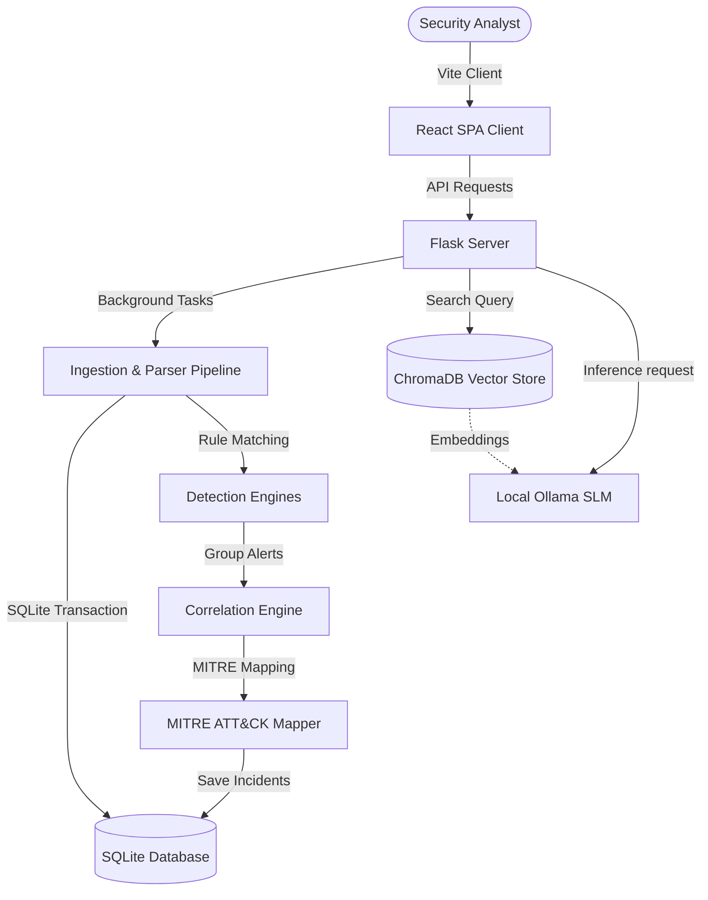

# Security Log Analysis Assistant 🛡️

A production-quality, local-first platform designed for Security Operations Center (SOC) teams and Blue Teams. It enables offline analysis of security logs using local Small Language Models (SLMs) through Ollama, providing threat detection, incident correlation, MITRE ATT&CK mapping, and AI-powered recommendations without relying on external cloud services (ensuring zero data leaks).

---

## Key Features

1. **Multi-Format Ingestion**: Auto-detects and parses Windows Event Logs (XML), Linux Syslogs (RFC 5424/BSD/Plain text), JSON/NDJSON streams (Zeek/Suricata), and CSV firewall/access logs.
2. **Correlation & Threat Scoring**: Automatically correlates discrete alerts into multi-stage security incidents using sliding time-windows, source IPs, and target hosts. Calculates a threat score (0-100) based on severity and attack complexity.
3. **MITRE ATT&CK Mapping**: Maps detected threat behaviors to standardized MITRE techniques (e.g., T1110 Brute Force, T1046 Service Discovery, T1548 Abuse Elevation Control, T1021 Remote Services, etc.).
4. **Offline AI Copilot**: Multi-turn chat assistant powered by a local Ollama instance (`qwen3:8b`) to explain anomalies and answer security triage questions.
5. **Retrieval-Augmented Generation (RAG)**: Integrates ChromaDB vector store to inject relevant security playbooks and encyclopedia references into AI chat contexts.
6. **Triage Reporting**: Automatically compiles clean, print-friendly HTML incident summaries for executive handoff.

---

## Technology Stack

- **Backend**: Flask, SQLAlchemy (SQLite), Pydantic, Alembic, Jinja2 (reporting)
- **Vector Database**: ChromaDB (RAG search)
- **AI Core**: Ollama (Local SLM runner with `qwen3:8b` or alternative models)
- **Frontend**: React (Vite), TypeScript, Tailwind CSS, Recharts (visualizations), Lucide React
- **Containerization**: Docker, Docker Compose

---

## System Architecture



---

## How to Run

### Prerequisites

- [Docker & Docker Compose](https://docs.docker.com/get-docker/)
- [Ollama](https://ollama.com/) (installed locally)

### Setup & Run

1. Ensure Ollama is running on your host machine:
   ```bash
   ollama serve
   ```
2. Pull the target language model:
   ```bash
   ollama pull qwen3:8b
   ```
3. Run the complete application container stack:
   ```bash
   docker-compose up --build
   ```
4. Access the frontend at: `http://localhost:5173`
5. Access the interactive API docs at: `http://localhost:8000/api/v1/docs`

---

## Detailed Project Guides

- For a comprehensive testing and validation guide, refer to: [TEST_PROJECT_GUIDE.md](file:///c:/Users/VENKATESH/OneDrive/Desktop/security_log_analysit-/TEST_PROJECT_GUIDE.md)
- For the full folder structure layout, refer to: [docs/FOLDER_STRUCTURE.md](file:///c:/Users/VENKATESH/OneDrive/Desktop/security_log_analysit-/docs/FOLDER_STRUCTURE.md)


